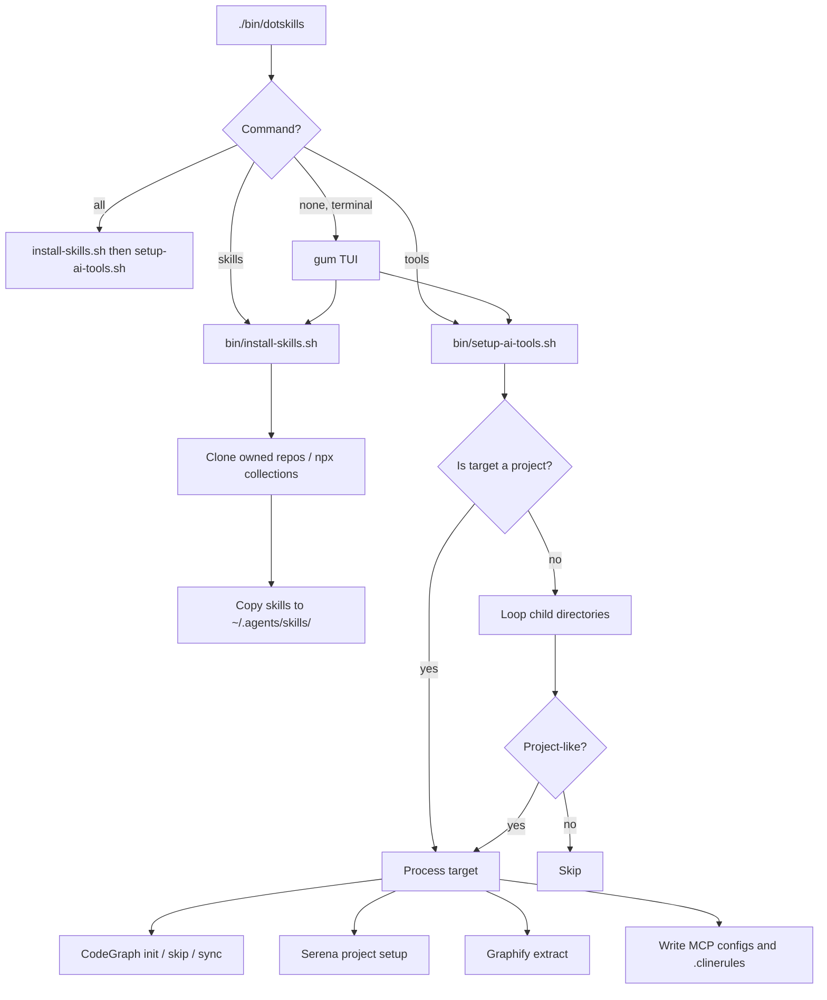
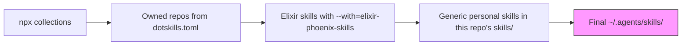
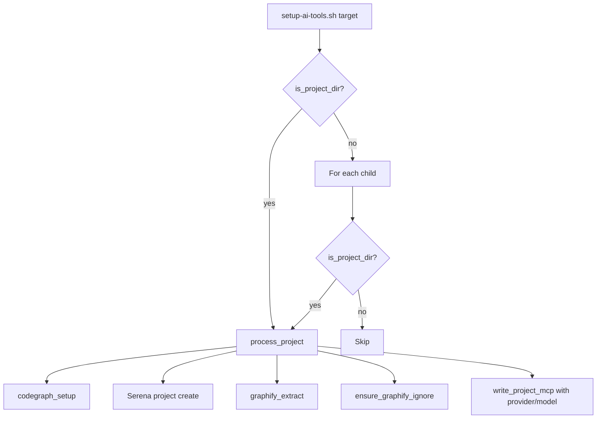

# dotskills

This is my personal agent skill ecosystem: one installer for the skills I author, plus a local script that sets up Serena, CodeGraph, and Graphify.

Agent skills are `SKILL.md` files that teach coding agents how to do specific jobs—write a PRD, run TDD, set up rs-guard, review code. They live in `~/.agents/skills/` and are loaded on demand by agents like Claude Code, Devin, and others.

This repo does three things:

1. **Holds my personal skills** in `skills/`. `setup-rs-guard` is optional and is not copied by a default `./install.sh`.
2. **Installs skills I author** via `bin/install-skills.sh` (`./install.sh` is a shim). It clones my repos and copies their `skills/` trees into `~/.agents/skills/`.
3. **Houses `bin/setup-ai-tools.sh`**, a bash program that installs and configures Serena, CodeGraph, and Graphify. It is not an agent skill.

The single entry point is `./bin/dotskills`. In a terminal it runs one gum menu; from scripts or CI it takes `skills`, `tools`, or `all` commands.

## Why public

Skills are configuration, not secrets. Sharing them openly means others can see the patterns, the install is reproducible, and the repo is a reference for building a personal skill ecosystem.

The default install must work on a fork that never uses rs-guard or Elixir.

## Why "personal"

The skills in `skills/` are tuned to my setup. `setup-rs-guard` references my GitHub username, my repo names, and my own mistakes. They are a personal runbook, not general-purpose skills.

If they are useful, fork the repo and replace the personal references with your own.

## `./install.sh` vs npx

- **Clone with `./install.sh`** only for skills you author. It copies trees into `~/.agents/skills/` and overwrites a same-named skill that npx already put there.
- **Install third-party and published collections with npx**, not a git clone. `npx skills install -g <slug> --all` pulls the whole collection and updates it the same way. Cloning those repos here fights npx and goes stale.

This machine's `~/.agents/skills/` mix is not a source of truth and is not copied into this repo.

## Skill sources

### `./install.sh` and `./bin/dotskills` (clone)

Interactive (`./bin/dotskills` or `./bin/dotskills skills` in a terminal):
- Uses `gh repo list --limit 50` to show your most recently updated GitHub repos.
- Multi-select with `gum`, or add a custom `owner/repo-name` not in the list.
- Requires `gh` installed and authenticated (`gh auth login`).

Non-interactive / script:
```bash
./bin/dotskills skills --repo owner/repo-name --repo owner/another-repo
./bin/dotskills skills --npx owainlewis/blueprint --npx owner/another-collection
./install.sh --repo owner/repo-name --repo owner/another-repo
./install.sh --npx owner/another-collection
```

| Priority | Source | When |
|----------|--------|------|
| 1 (highest) | `dotskills/skills/` (this repo) | Always. `setup-rs-guard` only with `--with-rs-guard`. |
| 2 | Default owned repos | Non-interactive, no `--repo` |
| 2 | Repos selected from `gh` / `--repo` | Interactive or explicit `--repo` |
| 2 | `igmarin/elixir-phoenix-skills` | `--with=elixir-phoenix-skills` (work-only) |

Later copies win. Personal skills override everything.

### npx (collections, not cloned)

Pass `--all` because these are collections. The `bin/dotskills` TUI shows the recommended list pre-selected and lets you add custom `owner/repo` slugs; non-interactively use `--npx owner/repo`.

```bash
npx skills install -g igmarin/agnostic-planning-skills --all
npx skills install -g igmarin/ruby-core-skills --all
npx skills install -g igmarin/rails-agent-skills --all
npx skills install -g owainlewis/agent-skills --all
npx skills install -g owainlewis/blueprint --all
npx skills install -g mattpocock/skills --all
npx skills install -g dietrichgebert/ponytail --all
```

`./install.sh --npx owner/repo` npx-installs that collection. It does not clone it. The recommended collections are pre-selected in the TUI.

### Optional extras (off by default)

| Flag | What it adds |
|------|-------------|
| `--npx owner/repo` | npx-install a collection, recommended or custom |
| `--with=elixir-phoenix-skills` | Clone `igmarin/elixir-phoenix-skills` (work-only) |
| `--with-rs-guard` | Copy `skills/setup-rs-guard` (personal runbook) |

## Personal skills

| Skill | What it does |
|-------|-------------|
| [`setup-rs-guard`](skills/setup-rs-guard/SKILL.md) *(optional)* | Runbook for adding rs-guard **v1.7.0** / **`deepseek-v4-pro`** to a repo. Install only with `./install.sh --with-rs-guard`. |

## Install

```bash
git clone https://github.com/igmarin/dotskills.git
cd dotskills
./bin/dotskills              # gum: pick skill repos, npx collections, tools, and repos
./install.sh                 # skills only: default owned repos
./bin/dotskills all --no-gum --no-install .
```

`./bin/dotskills` with no command, in a terminal, runs one gum session and then skills, then tools. The skills step uses `gh repo list` if `gh` is installed and authenticated; otherwise it falls back to the default owned repos.

- `./bin/dotskills skills [flags]` → `bin/install-skills.sh`
- `./bin/dotskills tools [flags]` → `bin/setup-ai-tools.sh`
- `./bin/dotskills all [flags]` → skills (defaults), then tools

`--dry-run` on `all` is passed to both skills and tools. On `all`, `--repo` and `--npx` go to `install-skills.sh` (when they are valid slugs), and `--provider`, `--model`, `--skip-*`, `--*-only`, and the target path go to `setup-ai-tools.sh`.

This will:

1. Create `~/.dotskills/sources/` and clone the selected source repos there.
2. Copy those skills into `~/.agents/skills/`.
3. Copy generic personal skills last (they always win). `setup-rs-guard` is not copied unless you pass `--with-rs-guard`.

To update later:

```bash
./install.sh
```

Re-running is safe. It pulls the latest from each source and re-copies. It does not delete skills that left the list; run `./install.sh --clean` to remove them.

### Flags

| Flag | Description |
|------|-------------|
| `--dry-run` | Show what would happen without making changes |
| `--verbose` | Log each command as it executes |
| `--only=slug1,slug2` | Install only specified sources. Generic personal skills still copy; `setup-rs-guard` stays gated. |
| `--repo owner/repo` | Clone an additional owned repo (repeatable). Overrides the default list. |
| `--npx owner/repo` | npx-install a skill collection (repeatable). Pre-selected in the TUI. |
| `--with=elixir-phoenix-skills` | Also install `igmarin/elixir-phoenix-skills` (work-only) |
| `--with-rs-guard` | Also copy `skills/setup-rs-guard` |
| `--uninstall` / `--clean` | Remove all installed skills from `~/.agents/skills/` |
| `--help` | Show usage information |

### Dry run

```bash
./install.sh --dry-run
./bin/dotskills all --dry-run --npx owner/collection --provider openai --model gpt-4o .
```

Shows what would be installed and what tools would do without changing files.

### Verbose mode

```bash
./install.sh --verbose
```

Logs each command being executed for debugging or transparency.

### Selective install

```bash
./install.sh --only=igmarin/rails-agent-skills,igmarin/ruby-core-skills
```

Installs only the specified sources. Generic personal skills from this repo are still copied. `setup-rs-guard` is still skipped unless `--with-rs-guard`.

### Uninstall

```bash
./install.sh --uninstall
```

Removes all skills from `~/.agents/skills/` with a confirmation prompt.

## Local tool setup (`bin/setup-ai-tools.sh`)

This is a bash program you run in a terminal. It is not an agent skill. Do not look for `/setup-ai-tools`.

It installs and configures Serena, CodeGraph, and Graphify (MCP configs, global gitignore, optional gum TUI). Graphify defaults to DeepSeek `deepseek-v4-pro` and is configurable with `--provider` and `--model`.

Home of the script: `bin/setup-ai-tools.sh` in this repo. Always run that file (or a symlink you create). Do not hardcode a volume or username.

Optional: from the parent of this clone, link the script so you can run it next to your other repos:

```bash
cd /path/to/dotskills
ln -sfn "$PWD/bin/setup-ai-tools.sh" "$(dirname "$PWD")/setup-ai-tools.sh"
```

```bash
# From this repo
./bin/setup-ai-tools.sh --no-gum --no-install .

# From the parent folder, if you created the symlink
../setup-ai-tools.sh /path/to/a/repo
```

Interactive (gum): run with no mode flags in a terminal. Flags still work for scripts and CI (`--no-gum`, `--no-install`, `--dry-run`, `--force`, `--serena-only`, `--codegraph-only`, `--graphify-only`, `--skip-serena`, `--skip-codegraph`, `--skip-graphify`, `--provider <name>`, `--model <name>`).

**Graphify extra:** `uv tool install --force --reinstall "graphifyy[mcp,openai]"`. DeepSeek extract needs the `openai` extra.

**CodeGraph:**

- `.codegraph` missing → `codegraph init`
- `.codegraph` exists → skip
- `--force` and `.codegraph` exists → `codegraph sync` (incremental), not `init`, not a full `index`

**`.graphifyignore`:** Graphify reads this file from the repo being extracted.
- The committed `.graphifyignore` at this repo's root is used when Graphify runs on this repo.
- `setup-ai-tools.sh` creates/updates `.graphifyignore` in each processed repo using the same patterns.
- To change patterns for this repo: edit the committed file.
- To change patterns for other repos: edit `bin/lib/graphify.sh` or open a PR.

## Adapting this for yourself

1. Fork this repo.
2. Replace the personal skills in `skills/` with your own.
3. Edit `dotskills.toml` at the repo root — add your owned repos and npx collections.
4. Put private or machine-specific overrides in `~/.dotskills/config.toml`. Values there override `dotskills.toml`.
5. Update the README table above if you keep the same layout.

`bin/install-skills.sh` (and the `./install.sh` shim) needs `git`. `--npx owner/repo` also needs `npx`.
`bin/setup-ai-tools.sh` needs `uv` (for Serena/Graphify) and `npm` (for CodeGraph).
`bin/dotskills` and `bin/install-skills.sh` need `python3` (3.11+ or `tomli` installed) to read `dotskills.toml`; if Python is missing, they fall back to the hard-coded defaults.
`bin/dotskills` uses `gum` for the interactive menu.

## How it works

### Full flow



### Source priority



### Tool setup per repo



## Structure

```
dotskills/
├── bin/
│   ├── dotskills                  # One flow: gum TUI, or skills | tools | all
│   ├── install-skills.sh          # Owned skill clones + personal skills/
│   ├── setup-ai-tools.sh          # Thin dispatcher: flags, lib calls, repo loop
│   ├── run-tests.sh               # Local test runner
│   └── lib/
│       ├── common.sh              # Shared log, run, add_if_missing, valid_slug
│       ├── config.sh              # dotskills.toml / ~/.dotskills/config.toml loader
│       ├── paths.sh               # script_dir_of (symlink-safe)
│       ├── detect-tools.sh        # Tool resolution + optional install
│       ├── codegraph.sh           # init / skip / sync
│       ├── graphify.sh            # Extra check, extract, .graphifyignore
│       ├── gitignore.sh           # Global gitignore + untrack MCP configs
│       ├── grok-mcp.sh            # Grok MCP config (TOML) and rules
│       └── write-mcp.sh           # Devin / Cline / Zed MCP + rules orchestrator
├── install.sh                     # Shim → bin/install-skills.sh
├── dotskills.toml                 # Repo-level config for owned repos and npx collections
├── skills/                        # Personal skills (shipped with this repo)
│   └── setup-rs-guard/            # Optional — not copied unless --with-rs-guard
│       └── SKILL.md
├── .graphifyignore                # Used by Graphify in this repo (script writes the same name elsewhere)
├── docs/
│   ├── PLAN-setup-ai-tools-and-refresh.md
│   ├── PLAN-split-setup-scripts.md
│   ├── PROMPT-new-session.md
│   ├── PROMPT-split-setup-scripts.md
│   └── SOURCES.md
├── .github/workflows/ci.yml       # GitHub Actions CI
├── .pre-commit-config.yaml        # Optional pre-commit hook
├── test-validation.sh             # Unit and integration tests
└── README.md
```

## Lib file contracts

Each `bin/lib/*.sh` is sourced by callers and is not executed directly. They follow these rules:

- `return 1` on recoverable failure; `exit 1` is reserved for top-level scripts.
- No `set -e` inside lib files; the caller sets the execution policy.
- Lib files may source `common.sh`; they do not depend on machine-absolute paths.
- `write-mcp.sh` is the orchestrator; `gitignore.sh` and `grok-mcp.sh` are single-client/concern modules it sources.

Source clones are stored at `~/.dotskills/sources/` (not committed here).

Any convenience symlink lives outside this git repo on purpose (parent folder of the clone).

## Error handling

When a source repository has uncommitted changes, the installer uses `git fetch` followed by `git reset --hard` to get a clean update without merge conflicts. This prevents "dirty working directory" errors during updates.
