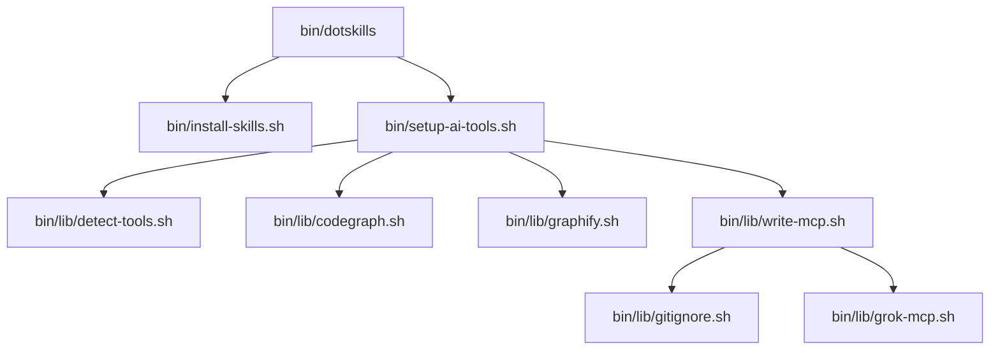

# Source files, arrays, and lib module map

This doc maps the constants, arrays, `dotskills.toml`, and `bin/lib/` modules so the next graph build can connect otherwise-isolated nodes.

## Configuration

### `dotskills.toml`

The repo-level config lives at the repo root. It holds:

- `repos.owned` — repos to clone for skills.
- `npx.community` — npx skill collections shown pre-selected in the TUI.

Personal or machine-specific overrides go in `~/.dotskills/config.toml`. Values there override the repo file.

### `bin/lib/config.sh`

- `load_dotskills_config(repo_root)` — parses `dotskills.toml` and `~/.dotskills/config.toml` with Python's `tomllib` (or `tomli` fallback). Merges user config over repo config and sets `OWNED_REPOS` and `NPX_COMMUNITY`.
- Sourced by `bin/install-skills.sh` and `bin/dotskills`.

## `bin/install-skills.sh` arrays

These arrays control which skills get installed and where they come from.

- `OWNED_REPOS` — fallback list of personal skill repos. Loaded from `dotskills.toml`, then `~/.dotskills/config.toml`, then the hard-coded default if neither exists. Used only when `gh` is missing/not authed and no `--repo` flag is passed.
- `NPX_COMMUNITY` — recommended npx skill collections, including `igmarin/` repos and third-party collections. Pre-selected in the `bin/dotskills` TUI; not installed unless selected. Also loaded from `dotskills.toml` / user config with fallback.
- `NPX_OVERRIDES` — runtime list from `--npx owner/repo` flags.
- `SOURCE_REPOS` — runtime list built from `--repo` overrides (or `OWNED_REPOS` fallback) + optional `--with=elixir-phoenix-skills`. Used to clone or update sources under `~/.dotskills/sources/`.
- `--repo owner/repo` — repeatable flag that adds a GitHub repo (`https://github.com/owner/repo.git`, `skills/` subdir) to `SOURCE_REPOS`.
- `--npx owner/repo` — repeatable flag that npx-installs a skill collection.

`bin/dotskills` (interactive) calls `select_gh_repos()` to list the last 50 updated repos via `gh repo list --limit 50`, then `gum choose --no-limit` for multi-select, then allows custom `owner/repo` input. Selected repos are passed as `--repo owner/repo` to `install-skills.sh`. For npx collections, the TUI shows `NPX_COMMUNITY` pre-selected and allows custom `owner/repo` npx slugs; selected ones are passed as `--npx owner/repo`.

The script also uses `assert_under_sources()` and `valid_slug()` (from `bin/lib/common.sh`) to keep all paths inside `~/.dotskills/sources/` and reject path-escape slugs.

## `bin/setup-ai-tools.sh` setup constants

- `PATH` — the script prepends `$HOME/.local/bin`, `/opt/homebrew/bin`, and `/usr/local/bin` so `uv`, `npm`, `grok`, `serena`, `codegraph`, and `graphify` resolve in non-interactive shells.
- Default tool flags: `RUN_SERENA`, `RUN_CODEGRAPH`, `RUN_GRAPHIFY`, `FORCE_REBUILD`, `AUTO_INSTALL`, `DRY_RUN`.
- `--repo` can be repeated to target multiple repos; otherwise it defaults to the current directory.
- `GRAPHIFY_BACKEND` (default `deepseek`) and `GRAPHIFY_MODEL` (default `deepseek-v4-pro`) are configurable via `--provider` / `--model` or the corresponding environment variables.
- `--dry-run` prints what the script would do and writes no files.

## `bin/lib/` module map

All lib files are sourced by `setup-ai-tools.sh` (and `common.sh` is also sourced by `bin/dotskills`, `install-skills.sh`, and some lib files).

- `common.sh` — `log`, `info`, `ok`, `warn`, `log_cmd`, `run`, `add_if_missing`, `is_project_dir`, `list_child_repo_names`, `valid_slug`.
- `paths.sh` — `script_dir_of`, symlink-safe directory resolution.
- `config.sh` — `load_dotskills_config` for `dotskills.toml` and user overrides.
- `detect-tools.sh` — `resolve_tool_bins`, `ensure_uv`, `install_serena`, `install_codegraph`, `install_graphify`, `ensure_missing_tools`.
- `codegraph.sh` — `codegraph_setup`: init only if `.codegraph` is missing; `codegraph sync` on `--force`.
- `graphify.sh` — `ensure_graphify_mcp_extra` (mcp + openai extras), `ensure_graphify_ignore`, `graphify_extract`.
- `gitignore.sh` — `setup_global_gitignore`, `untrack_mcp_configs`.
- `grok-mcp.sh` — `upsert_grok_mcp_toml`, `_setup_grok_global`, `_write_grok_project` (templated with provider/model).
- `write-mcp.sh` — orchestrator: sources `common.sh`, `gitignore.sh`, `grok-mcp.sh`; writes Devin / Cline / Zed global and project configs plus `.clinerules` (templated with provider/model).

## Tool chain

The flow is:

1. `bin/dotskills` (optional gum TUI) → `bin/install-skills.sh` and/or `bin/setup-ai-tools.sh`
2. `bin/setup-ai-tools.sh` → `bin/lib/detect-tools.sh` → tool install/resolution
3. `bin/setup-ai-tools.sh` → `bin/lib/codegraph.sh`, `bin/lib/graphify.sh`, `bin/lib/write-mcp.sh` → per-repo setup
4. `bin/lib/write-mcp.sh` → `bin/lib/gitignore.sh` and `bin/lib/grok-mcp.sh` for gitignore and Grok wiring

